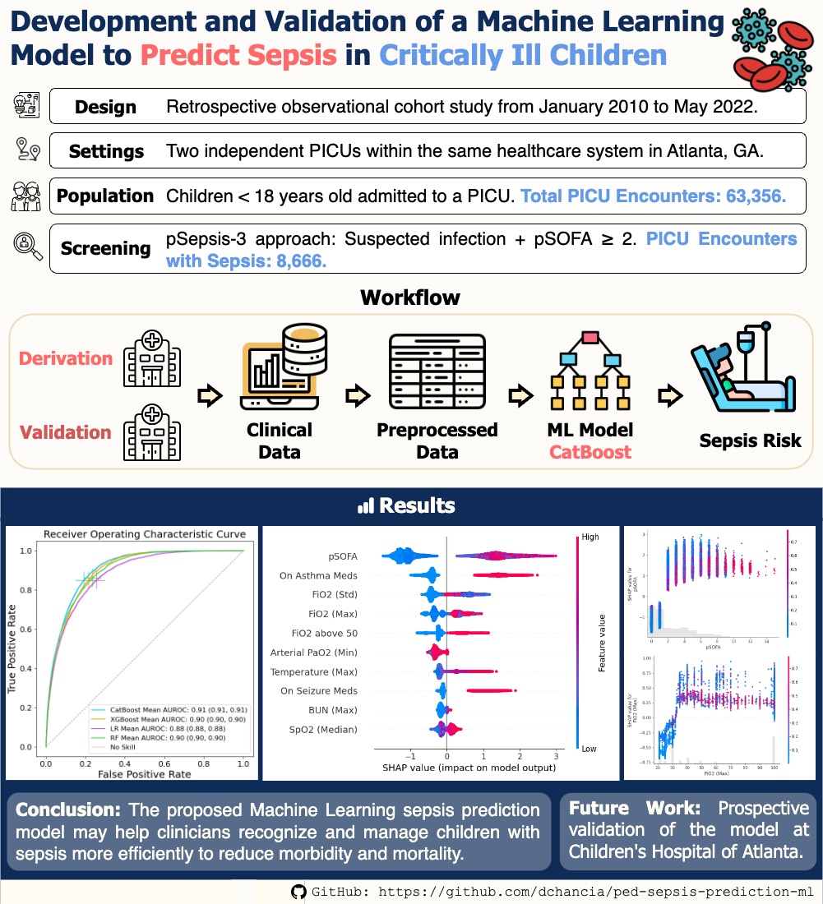

# Pediatric Sepsis Prediction

This repository provides code and models for a sepsis prediction model for a retrospective study for Pediatric Intensive Care Unit (PICU) patients admitted to Children's Healthcare of Atlanta (CHOA) from 2010 to 2022.

## Overview

## Sepsis Cohorts

To identify the required sepsis cohort, we followed 3 different screening approaches: **pSepsis-3**, SIRS + OD, and INF + SIRS + OD. The same inclusion criteria applied to all of them: children younger than 18 years old admitted at least once to the PICU during their hospitalization.

- pSepsis-3: Patients with suspected infection and pSOFA score $\ge$ 2 from 48 hours before to 24 hours after the infection time. Selected for final model.
- SIRS + OD: Patients with systemic inflammatory response syndrome and acute organ dysfrunction within a period of 24 hours.
- INF + SIRS + OD: Patients with suspected infection and SIRS + OD from 48 hours before to 24 hours after the infection time.

The scripts for the screening approaches are in the folder [`screening_methods`](./screening_methods/) using the data generated with the scripts in the folder [`data_screening`](./data_screening/).

## Requirements

- Python >= 3.9.12
- [`requirements.txt`](./requirements.txt)

## Sepsis Prediction Model

We trained CatBoost, XGBoost, Random Forest, and Logistic Regression models for each of the 3 cohorts. The selected model, with the best performance, is CatBoost for the pSepsis-3 cohort. It outputs the risk of sepsis within the first seven days of hospital admission for PICU patients. Download the trained model: [`sepsis_catboost.cbm`](./models/sepsis_catboost.cbm)

### Features

| Features                                                                       |
|--------------------------------|-----------------------------------------------|
| Vital signs                    | Diastolic blood pressure                      |
|                                | Systolic blood pressure                       |
|                                | Mean arterial blood pressure                  |
|                                | Heart rate                                    |
|                                | Respiratory rate                              |
|                                | Oxygen saturation (SpO2)                      |
|                                | Temperature                                   |
| Laboratory Tests               | Albumin                                       |
|                                | Base excess                                   |
|                                | Base deficit                                  |
|                                | Arterial PaCO2                                |
|                                | Arterial PaO2                                 |
|                                | Bicarbonate                                   |
|                                | Bilirubin                                     |
|                                | Blood urea nitrogen (BUN)                     |
|                                | Calcium                                       |
|                                | Ionized calcium                               |
|                                | Chloride                                      |
|                                | Carbon dioxide (CO2)                          |
|                                | Creatinine                                    |
|                                | Glucose                                       |
|                                | Hemoglobin                                    |
|                                | Lactic acid                                   |
|                                | pH                                            |
|                                | Platelets                                     |
|                                | Potassium                                     |
|                                | Partial thromboplastin time (PTT)             |
|                                | Sodium                                        |
|                                | White blood cell (WBC) count                  |
| Demographics                   | Age group                                     |
| Scoring Systems                | pSOFA                                         |
| Other Clinical Characteristics | Fraction inspired oxygen (FiO2)               |
|                                | PaO2/FiO2                                     |
|                                | Left pupil size                               |
|                                | Left pupil reaction                           |
|                                | Abnormal heart rate                           |
|                                | Abnormal respiratory rate                     |
|                                | Abnormal temperature                          |
|                                | Abnormal WBC                                  |
|                                | Abnormal band neutrophils                     |
|                                | Abnormal systolic blood pressure              |
|                                | Abnormal base deficit                         |
|                                | Abnormal lactic acid                          |
|                                | Abnormal prothrombin time (PT)                |
|                                | Abnormal international normalized ratio (INR) |
|                                | Abnormal alanine aminotransferase (ALT)       |
|                                | Abnormal aspartate aminotransferase (AST)     |
|                                | Low platelets                                 |
|                                | Elevated creatinine                           |
|                                | Two consecutive SpO2 <= 90                    |
|                                | FiO2 > 50                                     |
|                                | On asthma medications                         |
|                                | On seizure medications                        |
|                                | On insulin                                    |