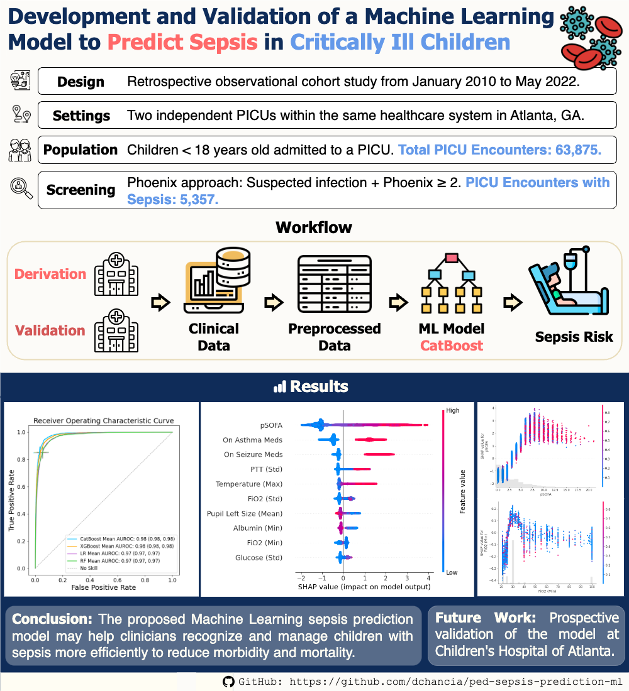
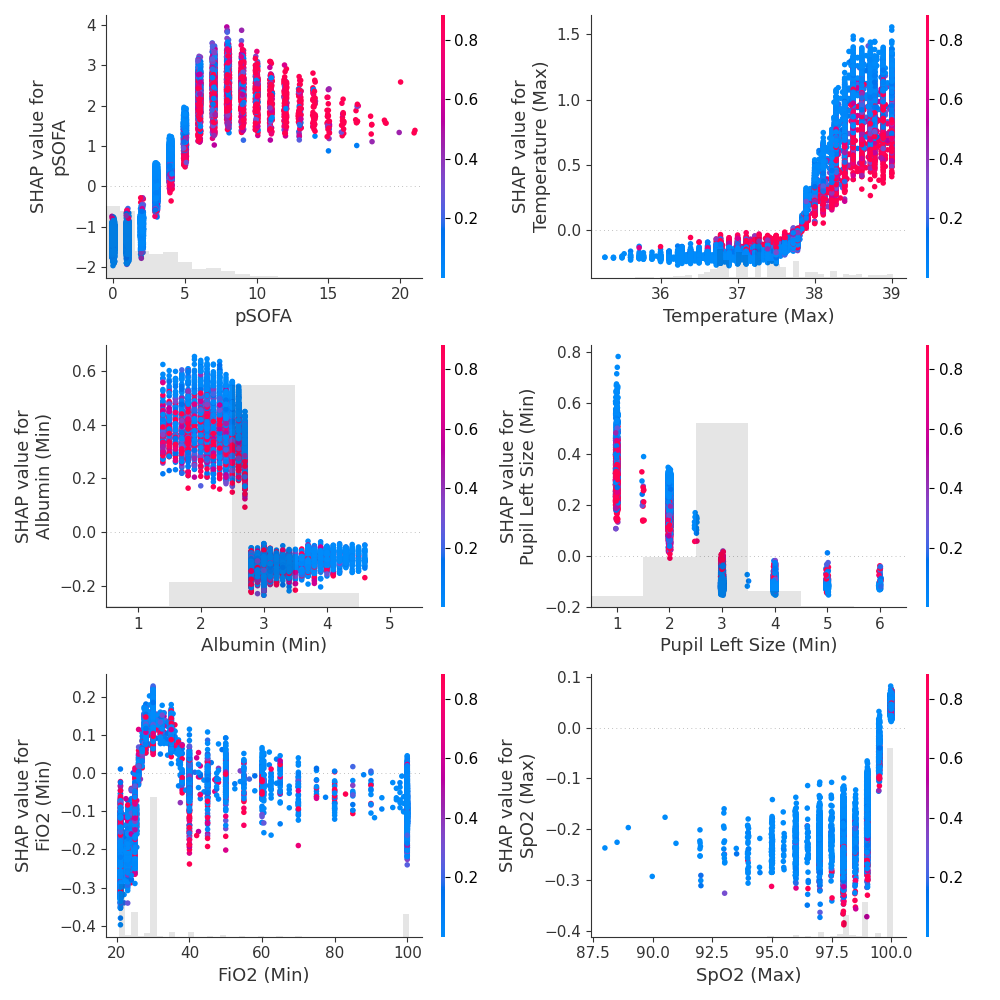

# Pediatric Sepsis Prediction

This repository provides code and models for a sepsis prediction model for a retrospective study for Pediatric Intensive Care Unit (PICU) patients admitted to Children's Healthcare of Atlanta (CHOA) from 2010 to 2022.

## Overview

## Sepsis Cohorts

To identify the required sepsis cohort, we followed 3 different screening approaches: **Phoenix**, pSepsis-3, and SIRS + OD. The same inclusion criteria applied to all of them: children younger than 18 years old admitted at least once to the PICU during their hospitalization.

- Phoenix: Patients with suspected infection and Phoenix score $\ge$ 2. Selected for final model.
- pSepsis-3: Patients with suspected infection and pSOFA score $\ge$ 2. 
- SIRS + OD: Patients with systemic inflammatory response syndrome and acute organ dysfrunction.

The scripts for the screening approaches are in the folder `/screening_methods` using the data generated with the scripts in the folder `/data_screening`.

## Requirements

- Python >= 3.9.12
- `requirements.txt`

## Sepsis Prediction Model

We trained CatBoost, XGBoost, Random Forest, and Logistic Regression models for each of the 3 cohorts. The selected model, with the best performance, is CatBoost for the Phoenix cohort. It outputs the risk of sepsis within the first seven days of hospital admission for PICU patients. 

### Features

| Features |         |
|----------|---------|
| Vital signs     | Diastolic blood pressure Systolic blood pressure Mean arterial blood pressure Heart rate Respiratory rate  Oxygen saturation (SpO2) Temperature |
| Laboratory Tests| Albumin Base excess Base deficit Arterial PaCO2 Arterial PaO2 Bicarbonate Bilirubin Blood urea nitrogen (BUN) Calcium Ionized calcium Chloride Carbon dioxide (CO2) Creatinine Glucose Hemoglobin Lactic acid pH Platelets Potassium Partial thromboplastin time (PTT) Sodium White blood cell (WBC) count |
| Demographics                   | Age group                                     |
| Scoring Systems                | pSOFA                                         |
| Other Clinical Characteristics | Fraction inspired oxygen (FiO2) PaO2/FiO2 Left pupil size Left pupil reaction Abnormal heart rate Abnormal respiratory rate Abnormal temperature Abnormal WBC Abnormal band neutrophils Abnormal systolic blood pressure Abnormal base deficit Abnormal lactic acid Abnormal prothrombin time (PT) Abnormal international normalized ratio (INR) Abnormal alanine aminotransferase (ALT) Abnormal aspartate aminotransferase (AST) Low platelets Elevated creatinine Two consecutive SpO2 <= 90 FiO2 > 50 On asthma medications On seizure medications On insulin |

### Preprocessing

The `preprocess_m1.ipynb` notebook in the `/data_models` folder shows the adopted preprocessing pipeline. It can be summarized in the following steps:

1. Collect data obtained within the first 7 days of hospital stay.
2. Resample data into one hour bins, using the median if there are multiple values recorded.
3. Discard outliers.
4. Impute missing values using forward fill for a patient-wise imputation, followed by population median imputation for the remaining missing values.
5. Select the 24-hour windows.
6. Aggregate data into a 24-hour bin using the mean, median, standard deviation, minimum, and maximum.
7. Add demographic information - age.
8. Add medications flags.

The `/train_test_models/utils/preprocess_utils.py` script contains multiple functions to split, normalize, and balance the dataset.

### Training

`/train_test_models/train_test_catboost.py`.

### Validation

- Internal: Using the derivation dataset. 95% CI calculated using 50 different seeds for the train/test split. `/train_test_models/internal_val.py`.
- External: Using the external validation dataset. 95% CI calculated using bootstrapping. `/train_test_models/internal_val.py`.

### Interpretability

We generated shap beeswarm and scatter plots for the most important features using the the SHAP library. `/train_test_models/shap_catboost.py`.

  
   

